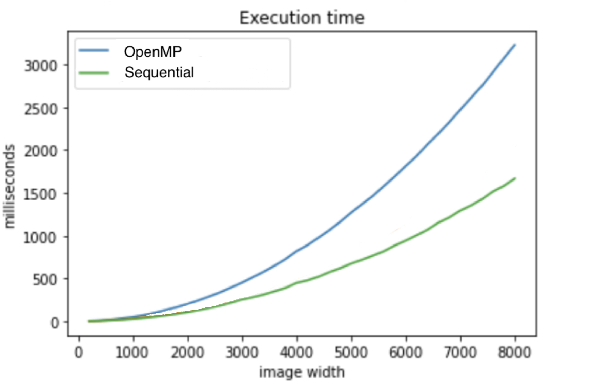

# Intro 

This repository contains an implementation of [Local Binary Pattern](https://en.wikipedia.org/wiki/Local_binary_patterns) algorithm using OpenMP.
The project is made to compare speed performances wrt [sequential version](https://github.com/MarcoSolarino/LBPSequential/tree/master).


# Usage

- Place an image in .jpg format in ```input/``` folder
- Run the program specifying the image name
- At the end of the run an histogram will be generated in ```output/```

# Performances
<p align = "center">

</p>
<p align = "center">
Running time for different sizes of a square image
</p>

You can check our tests on the [report](/docs/report.pdf) (_available in italian only, sorry_)


# More details

We also made a similar comparison between sequential vs [multithread version](https://github.com/sim-pez/lbp_omp) on CPU only.


# Acknowledgments
Parallel Computing - Computer Engineering Master Degree @[University of Florence](https://www.unifi.it/changelang-eng.html).
